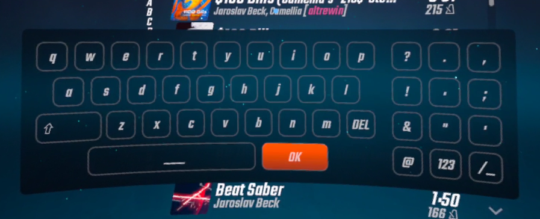

# MoreButtons

Allows typing of many special characters on the default Beat Saber keyboard by modifying the number pad mobile-style.

## Layouts

|123|||
|:-:|:-:|:-:|
|7|8|9|
|4|5|6|
|1|2|3|
|0|?!|+=|

|?!|||
|:-:|:-:|:-:|
|?|.|,|
|!|:|;|
|&|"|'|
|@|123|/_|

|+=|||
|:-:|:-:|:-:|
|*|(|)|
|-|[|]|
|+|{|}|
|=|123|/_|

|/_|||
|:-:|:-:|:-:|
|_|/|\\ |
|#|<|>|
|%|~|`|
|$|?!|+=|
